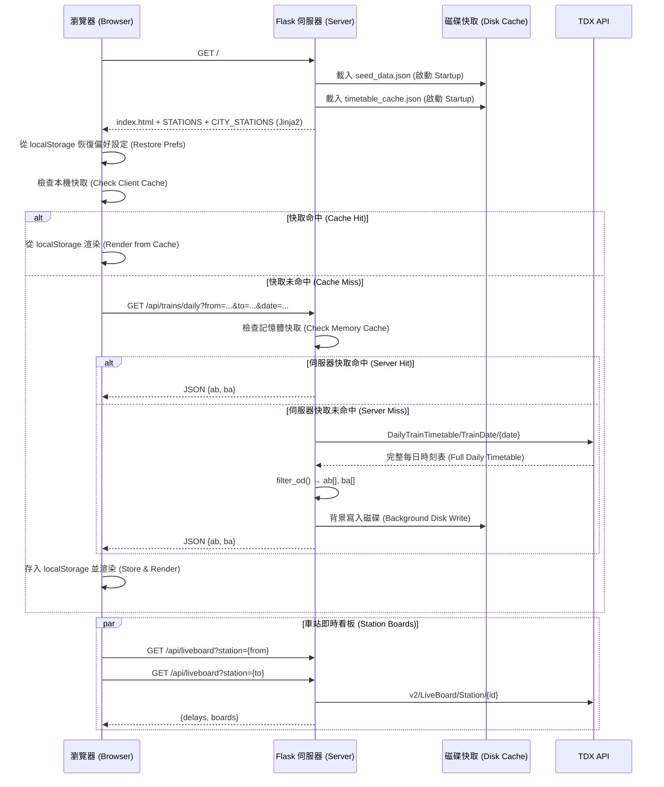
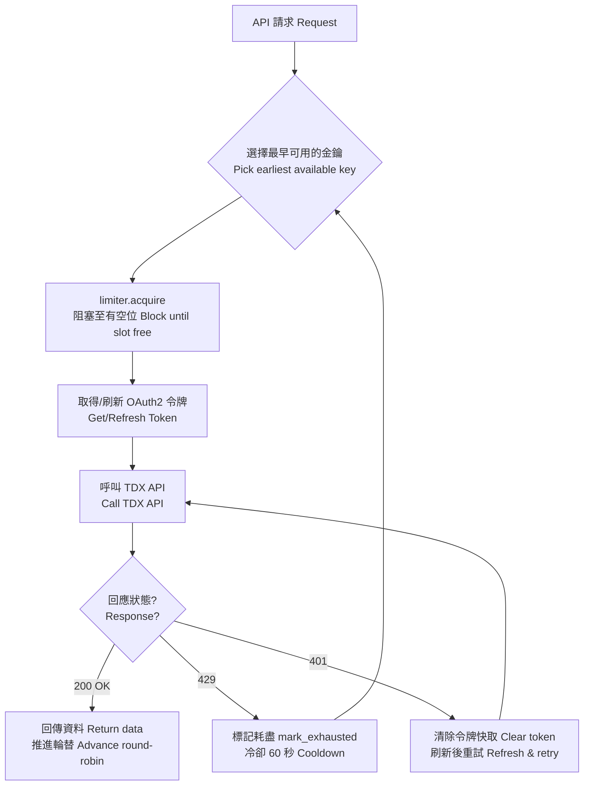
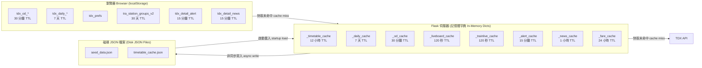

# 台鐵時刻表 — TDX Train Timetable Web App

## 簡介 (Briefing)

本網站是一套以 Flask 為後端 (Backend) 的台鐵時刻表查詢系統，資料來源為**交通部 TDX 運輸資料流通服務平臺 (Taiwan Transport Data eXchange)**。具備深色主題 (Dark Theme) 響應式介面 (Responsive UI)、多層快取 (Multi-Layer Cache)（瀏覽器 (Browser) → 伺服器記憶體 (Server Memory) → 磁碟 (Disk)），並部署於 Render.com。

---

## 功能 (Features)

- **常態班表查詢 (General Timetable Query)** — 任意兩站間靜態時刻表 (Static Timetable) 起迄站查詢 (OD Query)
- **當日班次查詢 (Daily Schedule Query)** — 指定日期實際行駛班次
- **即時狀態 (Live Status)** — TDX 即時看板 API (LiveBoard API) 即時誤點疊加 (Delay Overlay)
- **車站即時看板 (Station Live Board)** — 出發/到達站即時到離站看板（往北 (Northbound) / 往南 (Southbound)）
- **列車詳細頁 (Train Detail Page)** — 單一車次停靠站清單 (Stop List)、即時位置 (Live Position)、通阻通知 (Alerts)、最新消息 (News)
- **車種篩選 (Train Type Filter)** — 對號列車 (Reserved) / 區間車 (Local) / 區間快 (Express)
- **票價查詢 (Fare Query)** — 起迄站間各車種票價，24 小時快取 (24h Cache)
- **常用車站 (Frequent Stations)** — 自動追蹤常用站
- **城市分組選站 (City-Grouped Picker)** — 依城市分組並標示車站等級 (Station Class)（◆ ● ★ ▸）
- **顯示筆數控制 (Row Count Control)** — 5 / 7 / 8 / 9 / 10 / 12 / 15 / 20 / 全部
- **響應式設計 (Responsive Design)** — 針對 ≤600px / ≤768px 斷點 (Breakpoints) 優化

---

## 技術棧 (Tech Stack)

| 層級 (Layer)     | 技術 (Technology)                                        |
|------------------|----------------------------------------------------------|
| 後端 (Backend)   | Python 3.11, Flask 3.x, Gunicorn                        |
| 前端 (Frontend)  | Vanilla JS, Jinja2 模板 (Templates), CSS3 自訂屬性 (Custom Properties) |
| 資料 (Data)      | TDX v2/v3 REST APIs (OAuth2 客戶端憑證 (Client Credentials)) |
| 部署 (Deploy)    | Render.com (`render.yaml`), 1 工作程序 (Worker) / 4 執行緒 (Threads) |
| 字型 (Fonts)     | Noto Sans TC, JetBrains Mono (Google Fonts)              |

---

## 專案結構 (Project Structure)

```
TDX_Deploy/Render/
├── app.py                    # Flask 後端 (Backend) ~1290 行
├── requirements.txt          # 相依套件 (Dependencies)
├── render.yaml               # Render.com 部署設定 (Deploy Config)
├── .env                      # TDX API 金鑰 (Keys)（不提交版控）
├── .env.txt                  # 環境變數範本 (Env Template)
├── seed_data.json            # 車站種子資料 (Station Seed Data)（自動更新）
├── timetable_cache.json      # 磁碟持久化快取 (Disk Cache)
├── templates/
│   ├── index.html            # 主頁模板 (Main Page Template)
│   └── train_detail.html     # 列車詳細頁模板 (Train Detail Template)
└── static/
    ├── index.css             # 主頁樣式 (Main Styles) ~600 行
    ├── index.js              # 主頁邏輯 (Main Logic) ~910 行
    ├── train_detail.css      # 詳細頁樣式 (Detail Styles) ~400 行
    ├── train_detail.js       # 詳細頁邏輯 (Detail Logic) ~320 行
    ├── readme.html           # 技術說明頁 (About Page)
    └── img/                  # SVG 架構圖 (Diagrams)
```

---

## 架構流程 (Architecture Flow)

### 頁面載入序列 (Page Load Sequence)



### API 金鑰速率限制 (API Key Rate Limiting)



### 快取架構 (Caching Architecture)



---

## 環境變數 (Environment Variables)

| 變數 (Variable)          | 必填 (Required) | 說明 (Description)                              |
|--------------------------|------------------|-------------------------------------------------|
| `TDX_CLIENT_ID`          | ✅               | TDX API 金鑰 (Key) #0 — 客戶端 ID (Client ID)  |
| `TDX_CLIENT_SECRET`      | ✅               | TDX API 金鑰 (Key) #0 — 客戶端密鑰 (Client Secret) |
| `FLASK_DEBUG`             | ❌               | 設為 `"1"` 啟用除錯模式 (Debug Mode)             |

---

## API 路由 (API Routes)

### 頁面路由 (Page Routes)

| 路由 (Route)               | 方法 (Method) | 說明 (Description)                          |
|----------------------------|---------------|---------------------------------------------|
| `/`                        | GET           | 主頁時刻表 (Main Timetable Page)             |
| `/train/<train_no>`        | GET           | 列車詳細頁 (Train Detail — Stops + Live)     |

### JSON API 路由 (JSON API Routes)

| 路由 (Route)                 | 方法 (Method) | 說明 (Description)                                              |
|------------------------------|---------------|-----------------------------------------------------------------|
| `/api/trains`                | GET           | 常態班表查詢 (General Timetable OD Query)（`from`, `to`）        |
| `/api/trains/daily`          | GET           | 當日班次查詢 (Daily Timetable OD Query)（`from`, `to`, `date`）  |
| `/api/fare`                  | GET           | 票價查詢 (Fare Query)（`from`, `to`）                            |
| `/api/liveboard`             | GET           | 車站即時看板 (Station Live Board)（`station`）                    |
| `/api/station-groups`        | GET           | 城市車站分組 (City→Station Groups)                               |
| `/api/train/<no>`            | GET           | 單一列車後設資料 (Metadata) + 完整停靠站 (Stop List)              |
| `/api/trainlive/<no>`        | GET           | 列車即時位置 (Real-Time Position)                                |
| `/api/alert`                 | GET           | 台鐵營運通阻 (Service Alerts)                                    |
| `/api/news`                  | GET           | 台鐵最新消息 (Latest News)                                       |
| `/api/fare`                  | GET           | 票價查詢 (Fare Query)                                            |
| `/health`                    | GET           | 健康檢查 (Health Check)                                          |
| `/debug/cache`               | GET           | 快取除錯 (Cache Debug)（僅除錯模式 (Debug Mode Only)）            |

---

## 函式說明 (Function Descriptions)

### 後端 (Backend) — `app.py`

#### 核心資料函式 (Core Data Functions)

| 函式 (Function)                    | 說明 (Description)                                                                 |
|------------------------------------|-----------------------------------------------------------------------------------|
| `api_get(url)`                     | 以每金鑰速率限制 (Per-Key Rate Limiting)、令牌刷新 (Token Refresh)、429 重試 (Retry)、輪替 (Round-Robin) 呼叫 TDX API |
| `get_all_trains()`                 | 回傳完整常態時刻表 (General Timetable)；快取於記憶體 (Memory) + 磁碟 (Disk)           |
| `fetch_daily_trains(date_str)`     | 回傳指定日期所有列車；同步自行車旗標 (BikeFlag) 至常態快取，修剪 (Prune) 舊日期       |
| `filter_od(all_trains, from, to)`  | 篩選停靠兩站且方向正確的列車 (Filter OD Trains)                                     |

#### 車站管理 (Station Management)

| 函式 (Function)                    | 說明 (Description)                                                                 |
|------------------------------------|-----------------------------------------------------------------------------------|
| `_load_seed_data()`                | 啟動 (Startup) 時從 `seed_data.json` 載入車站種子資料 (Seed Data)                    |
| `_load_disk_caches()`              | 啟動時從 `timetable_cache.json` 恢復快取 (Restore Caches)                           |
| `_load_stations_from_api()`        | 從 TDX v2 取得所有台鐵車站，更新全域變數 (Global Variables)                          |
| `_load_branch_lines()`             | 從 TDX StationOfLine API 取得支線 (Branch Line) 車站分組                            |
| `_save_timetable_disk_cache()`     | 於背景執行緒 (Background Thread) 序列化快取至磁碟（原子性寫入 (Atomic Write)）         |
| `_run_station_load_once()`         | 確保 `_load_stations_from_api()` 每程序 (Process) 僅執行一次                         |

#### 認證與速率限制 (Auth & Rate Limiting)

| 函式/類別 (Function/Class)      | 說明 (Description)                                                            |
|---------------------------------|------------------------------------------------------------------------------|
| `_KeyRateLimiter`               | 每金鑰滑動視窗速率限制器 (Sliding Window Rate Limiter)（5 req / 60s），阻塞式 (Blocking)，執行緒安全 (Thread-Safe) |
| `_load_key_pool()`              | 從環境變數 (Env Vars) 建構金鑰池 (Key Pool)                                    |
| `_get_token_for(key)`           | 回傳有效的 OAuth2 存取令牌 (Access Token)，過期時自動刷新 (Refresh)              |

#### 格式化輔助函式 (Formatting Helpers)

| 函式 (Function)               | 說明 (Description)                                                  |
|-------------------------------|---------------------------------------------------------------------|
| `_format_train_type(raw)`     | 縮短車種名稱 (Shorten Train Type)（如 "自強(推拉式)" → "自強PP"）     |
| `_parse_note(raw)`            | 移除 "每日行駛。" 前綴 (Strip Prefix)                                |
| `_tdx_str(v)`                 | 從 TDX 多語系物件 (Multilingual Object) 中提取 Zh_tw 字串            |

### 前端主頁 (Frontend Main Page) — `index.js`

| 函式/物件 (Function/Object)     | 說明 (Description)                                                                   |
|---------------------------------|--------------------------------------------------------------------------------------|
| `CacheManager`                  | 客戶端 localStorage 快取 (Client Cache)，含存活時間 (TTL)、40 key 上限、LRU 驅逐 (Eviction) |
| `loadPrefs()` / `savePrefs()`   | 讀寫使用者偏好設定 (User Preferences)（`tdx_prefs`）                                   |
| `trackUsage(code)`              | 遞增車站使用頻率計數器 (Frequency Counter)（常用車站功能）                               |
| `buildCitySelect()`             | 建構城市下拉選單 (City Dropdown)（含常用車站群組）                                      |
| `buildStationSelect()`          | 建構車站下拉選單 (Station Dropdown)（含等級前綴標記 (Class Prefix Markers)）              |
| `queryGeneral()`                | 取得常態班表 (General Timetable)（localStorage → 伺服器），渲染 (Render) 兩方向表格      |
| `queryDaily()`                  | 取得指定日期班表 (Daily Timetable)，填充 `dailyBikeMap`                                 |
| `fetchFare()`                   | 非同步取得票價 (Async Fare Fetch)，更新 `fareMap` 後重新渲染 (Re-Render)                 |
| `renderTable()`                 | 渲染單一時刻表 (Render Table)，含篩選 (Filtering)、已過班次灰顯 (Past Dimming)、自動捲動 (Auto-Scroll) |
| `renderTables()`                | 渲染去程/回程兩表格 (Render AB/BA Tables)，量測行高 (Measure Row Height) 以設定 `--tbl-max-h` |
| `fetchStationBoards()`          | 取得並渲染出發/到達站即時看板 (Live Station Boards)                                     |
| `fetchLive()`                   | 取得即時誤點 (Live Delay) 資料，疊加誤點徽章 (Delay Badges) 至表格列                    |
| `overlayDelays()`               | 新增/移除誤點標籤 (Delay Tags)（`誤X分`）                                              |
| `renderStationBoard()`          | 渲染車站即時看板卡片 (Station Board Card)（往北/往南分組 (N/S Grouping)）                 |
| `_applyMaxRows(n)`              | 以量測行高設定 CSS 變數 (CSS Variable) `--tbl-max-h`                                    |
| `escHtml(s)`                    | XSS 安全 HTML 跳脫 (HTML Escaping)（`&`, `<`, `>`, `"`）                               |

### 前端列車詳細頁 (Frontend Train Detail) — `train_detail.js`

| 函式 (Function)               | 說明 (Description)                                                                   |
|-------------------------------|--------------------------------------------------------------------------------------|
| `loadAll()`                   | 並行取得 (Parallel Fetch) 列車資料、即時位置、通阻通知、最新消息                         |
| `renderTrain(data, live)`     | 渲染完整停靠站表格 (Stop Table)，含已過/目前/出發/到達高亮 (Highlighting)                 |
| `computeStartIdx()`           | 從即時資料或時間估算判斷列車目前位置 (Current Position)                                  |
| `renderAlerts(alerts)`        | 渲染台鐵通阻通知卡片 (Alert Cards)                                                     |
| `renderNews(news)`            | 渲染台鐵最新消息卡片 (News Cards)（篩選 zh-tw）                                        |
| `fetchWithTimeout(url, ms)`   | 含中止控制器 (AbortController) 逾時的 fetch 包裝 (Wrapper)（預設 15 秒）                |
| `toggleSection(id)`           | 行動裝置 (Mobile) 上切換通阻/消息摺疊區塊 (Collapsible Sections)                        |

---

## 伺服器端變數與常數 (Server-Side Variables & Constants)

### 伺服器快取存活時間 (Server Cache TTLs)

| 快取 (Cache)                    | 變數 (Variable)          | 存活時間 (TTL)  | 驅逐策略 (Eviction Strategy)                      |
|---------------------------------|-------------------------|-----------------|---------------------------------------------------|
| 常態時刻表 (General Timetable)  | `GENERAL_CACHE_TTL`     | 12 小時 (Hours)  | 優先使用 API `ExpireDate` 欄位                     |
| 每日時刻表 (Daily Timetable)    | `DAILY_CACHE_TTL`       | 7 天 (Days)      | 修剪 (Prune) 超過 7 天的舊日期                     |
| 起迄站 (Origin-Destination)     | `OD_CACHE_TTL`          | 30 分鐘 (Min)    | 插入時驅逐 (Evict on Insert) 過期項目              |
| 即時看板 (LiveBoard)            | `LIVEBOARD_CACHE_TTL`   | 120 秒 (Sec)     | 插入時驅逐過期項目                                 |
| 列車即時 (TrainLive)            | `TRAINLIVE_CACHE_TTL`   | 120 秒 (Sec)     | 插入時驅逐過期項目                                 |
| 通阻通知 (Alerts)               | `ALERT_CACHE_TTL`       | 15 分鐘 (Min)    | 單一項目，刷新時覆寫 (Overwrite on Refresh)        |
| 最新消息 (News)                 | `NEWS_CACHE_TTL`        | 1 小時 (Hour)    | 單一項目，刷新時覆寫                               |
| 票價 (Fare)                     | `FARE_CACHE_TTL`        | 24 小時 (Hours)  | 插入時驅逐過期項目；雙向快取 (Bidirectional Cache) |

### 客戶端快取存活時間 (Client Cache TTLs)

| 鍵值模式 (Key Pattern)             | 存活時間 (TTL)  | 上限 (Max) | 備註 (Notes)                                   |
|-------------------------------------|-----------------|------------|------------------------------------------------|
| `tdx_od_{from}_{to}`               | 30 分鐘 (Min)    | 40         | 超過限制時 LRU 驅逐 (Eviction)                  |
| `tdx_daily_{from}_{to}_{date}`     | 7 天 (Days)      | 40         | 與 OD 快取共享限制 (Shared Limit)                |
| `tra_station_groups_v2`            | 30 天 (Days)     | 1          | 車站城市分組 (Station City Groups)               |
| `tdx_detail_alert`                 | 15 分鐘 (Min)    | 1          | 列車詳細頁通阻 (Detail Alerts)                   |
| `tdx_detail_news`                  | 15 分鐘 (Min)    | 1          | 列車詳細頁消息 (Detail News)                     |
| `tdx_prefs`                        | ∞ 永久           | 1          | 使用者偏好 (Preferences): from, to, maxRows, freq |
| `tdx_stn_mode`                     | ∞ 永久           | 1          | 車站看板顯示模式 (Board Display Mode)（0–3）      |
| `tdx_cache_ver`                    | ∞ 永久           | 1          | 快取版本 (Cache Version) 用於失效 (Invalidation)  |

### 速率限制器常數 (Rate Limiter Constants)

| 常數 (Constant)              | 值 (Value)    | 說明 (Description)                                |
|------------------------------|---------------|---------------------------------------------------|
| `_KeyRateLimiter.WINDOW`     | 60 秒 (Sec)  | 滑動視窗大小 (Sliding Window Size)                 |
| `_KeyRateLimiter.MAX_REQ`    | 5             | 每金鑰每視窗最大請求數 (Max Requests per Key per Window) |

### 車站資料常數 (Station Data Constants)

| 變數 (Variable)            | 說明 (Description)                                                            |
|----------------------------|------------------------------------------------------------------------------|
| `STATIONS`                 | `dict[str, str]` — 站名 (Name) → 代碼 (Code)（如 `"台北": "0970"`）          |
| `_STATION_CLASSES`         | `dict[str, int]` — 代碼 → 等級 (Class)（0=特等, 1=一等, 2=二等, 3=三等, 4=簡易） |
| `_STATION_GROUPS`          | `list[dict]` — 城市分組 (City Groups) `[{city, codes}, ...]` 地理順序排列     |
| `_STATION_PHONES`          | `dict[str, str]` — 代碼 → 電話 (Phone)                                       |
| `_STATION_ADDRESSES`       | `dict[str, str]` — 代碼 → 地址 (Address)                                     |
| `_HIDDEN_STATION_IDS`      | `set` — 隱藏的虛擬/特殊車站 (Hidden Virtual Stations)（`1001`, `5170`, `5998`, `5999`） |
| `_CITY_ORDER`              | `list[str]` — 19 個城市由北至南排序 (North-to-South Order)                     |
| `_TRIP_LINE_MAP`           | `{1: "山線", 2: "海線", 3: "成追線"}`                                         |
| `_BRANCH_LINE_GROUPS`      | 7 條支線 (Branch Lines) 的硬編碼備援 (Hardcoded Fallback)                      |
| `_VALID_CODES`             | `set[str]` — 所有有效車站代碼，用於輸入驗證 (Input Validation)                 |

---

## CSS 設計系統 (CSS Design System)

### 主題變數 (Theme Variables) — `:root`

| 變數 (Variable)  | 值 (Value)    | 用途 (Usage)                          |
|------------------|---------------|---------------------------------------|
| `--bg`           | `#05111f`     | 頁面背景 (Page Background)             |
| `--surface`      | `#0a1e33`     | 標題列、控制列 (Header, Controls)       |
| `--panel`        | `#0d2540`     | 卡片、輸入框 (Cards, Inputs)            |
| `--border`       | `#163556`     | 邊框、分隔線 (Borders, Separators)      |
| `--blue`         | `#4da8e8`     | 主要強調色 (Primary Accent)             |
| `--blue-dim`     | `#2a6a9e`     | 次要藍色 (Secondary Blue)               |
| `--gold`         | `#f5c842`     | 車次號碼、標題 (Train No, Headers)      |
| `--green`        | `#56d98a`     | 區間快徽章、準點 (Express, On-Time)     |
| `--red`          | `#f87171`     | 錯誤、誤點 (Errors, Delays)             |
| `--orange`       | `#fb923c`     | 回程、到達站 (Return Trip, Arrival)     |
| `--fg`           | `#c8dff0`     | 主要文字 (Primary Text)                 |
| `--fg-dim`       | `#6a8faa`     | 次要文字 (Secondary Text)               |
| `--font-mono`    | `JetBrains Mono` | 車次號碼、時間 (Numbers, Times)      |
| `--font-main`    | `Noto Sans TC`   | 本文字型 (Body Text)                 |
| `--radius`       | `8px`         | 圓角 (Border Radius)                    |
| `--transition`   | `0.18s ease`  | 預設過渡效果 (Default Transition)        |

### 動態表格高度 (Dynamic Table Height)

```css
.table-scroll {
  max-height: var(--tbl-max-h, calc(40px * 8 + 37px));
  overflow-y: auto;
}
```

`--tbl-max-h` 由 JavaScript 在量測 (Measure) 實際渲染行高 (Row Height)（`_measuredRowH`, `_measuredTheadH`）後動態設定，確保桌面 (Desktop) 與行動裝置 (Mobile) 的列數正確。

### 響應式斷點 (Responsive Breakpoints)

| 斷點 (Breakpoint) | 目標 (Target)          | 主要變更 (Key Changes)                                        |
|--------------------|------------------------|--------------------------------------------------------------|
| ≤ 800px            | 版面配置 (Layout)       | 表格垂直堆疊 (Vertical Stack)（單欄 (Single Column)）          |
| ≤ 768px            | 平板/手機 (Tablet/Mobile) | 精簡控制項、縮小字體 (Compact Controls, Smaller Fonts)        |
| ≤ 600px            | 手機 (Mobile)           | 車站看板堆疊 (Board Stack)、顯示手機列 (Mobile Bar)            |

### 車種色彩編碼 (Train Type Color Coding)

| 類別 (Category)                | 徽章類別 (Badge Class) | 背景 (Background)          | 文字色 (Text Color) |
|--------------------------------|------------------------|-----------------------------|---------------------|
| 對號列車 (Reserved Train)      | `.badge-reserved`      | `rgba(245,200,66,.15)`      | Gold                |
| 區間快 (Express Local)         | `.badge-express`       | `rgba(86,217,138,.15)`      | Green               |
| 區間車 (Local Train)           | `.badge-local`         | `rgba(77,168,232,.15)`      | Blue                |

### 備註標籤樣式 (Remark Tag Styles)

| 類型 (Type)            | 類別 (Class)         | 色系 (Color) | 範例 (Example)   |
|------------------------|----------------------|--------------|------------------|
| 路線 (Route Line)      | `.remark-line`       | 藍 (Blue)    | 山線, 海線       |
| 排程 (Schedule Note)   | `.remark-schedule`   | 金 (Gold)    | 週六行駛         |
| 座位 (Seat Info)       | `.remark-seat`       | 紅 (Red)     | 無座             |
| 自行車 (Bike Allowed)  | `.remark-bike`       | 綠 (Green)   | 🚲               |
| 誤點 (Delay)           | `.remark-delay`      | 紅 (Red)     | 誤5分             |

---

## 安全機制 (Security)

| 措施 (Measure)                              | 實作 (Implementation)                                                         |
|---------------------------------------------|-------------------------------------------------------------------------------|
| 內容安全政策 (Content Security Policy)       | `@app.after_request` — `default-src 'self'`, `frame-ancestors 'none'`         |
| 內容類型選項 (X-Content-Type-Options)        | `nosniff`                                                                     |
| 框架選項 (X-Frame-Options)                   | `DENY`                                                                        |
| XSS 防護 (XSS Prevention)                   | 兩個 JS 檔案中的 `escHtml()`；URL 參數使用 `encodeURIComponent()`               |
| 輸入驗證 (Input Validation)                  | 車站代碼比對 `_VALID_CODES`；車次號碼：`^\d{1,5}$`；日期：嚴格 `YYYY-MM-DD` + 範圍檢查 (Range Check) |
| 除錯端點保護 (Debug Endpoint Guard)          | `/debug/cache` 非除錯模式 (Debug Mode) 回傳 404                                |
| 原子性磁碟寫入 (Atomic Disk Writes)          | 暫存檔 (Temp File) + `Path.replace()`（種子資料與時刻表快取皆使用）              |
| 執行緒安全 (Thread Safety)                   | `_cache_lock`, `_pool_lock`, `_station_load_lock`, `_save_lock`                |

---

## 執行緒鎖 (Thread Locks)

| 鎖 (Lock)               | 保護對象 (Protects)                                                           |
|--------------------------|------------------------------------------------------------------------------|
| `_cache_lock`            | 全部 8 個記憶體快取字典 (Cache Dicts) + 令牌快取 (Token Caches) + 車站全域變數  |
| `_pool_lock`             | `_pool_index`（輪替金鑰選擇 (Round-Robin Key Selection)）                     |
| `_station_load_lock`     | `_station_load_done` 旗標 (Flag)（確保一次性車站 API 載入）                    |
| `_save_lock`             | 磁碟寫入序列化 (Disk Write Serialization)（非阻塞 (Non-Blocking) `acquire`）   |

---

## 快速開始 (Quick Start)

```bash
# 1. 進入專案目錄 (Enter project directory)
cd TDX_Deploy/Render

# 2. 建立虛擬環境 (Create virtual environment)
python -m venv .venv
.venv\Scripts\activate  # Windows
# source .venv/bin/activate  # Linux/Mac

# 3. 安裝相依套件 (Install dependencies)
pip install -r requirements.txt

# 4. 設定環境變數 (Set up environment variables)
cp .env.txt .env
# 編輯 .env 填入 TDX API 憑證 (Edit .env with TDX API credentials)

# 5. 啟動開發伺服器 (Run development server)
python app.py
# → http://localhost:5000
```

### 正式環境部署 (Production — Render.com)

透過 `render.yaml` 設定：
```
gunicorn app:app --workers 1 --threads 4 --timeout 120
```

---

## 使用的 TDX API 端點 (TDX API Endpoints Used)

| 端點 (Endpoint)                                    | 版本 (Version) | 用途 (Purpose)                                   |
|----------------------------------------------------|----------------|--------------------------------------------------|
| `GeneralTrainTimetable`                            | v3             | 常態時刻表 (General Timetable)                    |
| `DailyTrainTimetable/TrainDate/{Date}`             | v3             | 指定日期時刻表 (Date-Specific Timetable)           |
| `ODFare/{OriginID}/to/{DestID}`                    | v3             | 票價查詢 (Fare Query)                             |
| `Station`                                          | v2             | 車站資料 + 等級 (Station Data + Classes)           |
| `StationOfLine`                                    | v3             | 支線車站分組 (Branch Line Grouping)                |
| `LiveBoard/Station/{ID}`                           | v2             | 車站即時看板 (Station Live Board)                  |
| `TrainLiveBoard/TrainNo/{No}`                      | v3             | 列車即時位置 (Train Live Position)                 |
| `Alert`                                            | v3             | 營運通阻 (Service Alerts)                          |
| `News`                                             | v3             | 最新消息 (Latest News)                             |

---

*TDX Sample v1.0 — Copyright © 2026 KevinRewolf*
*資料介接「交通部TDX平臺」& 平臺標章*
