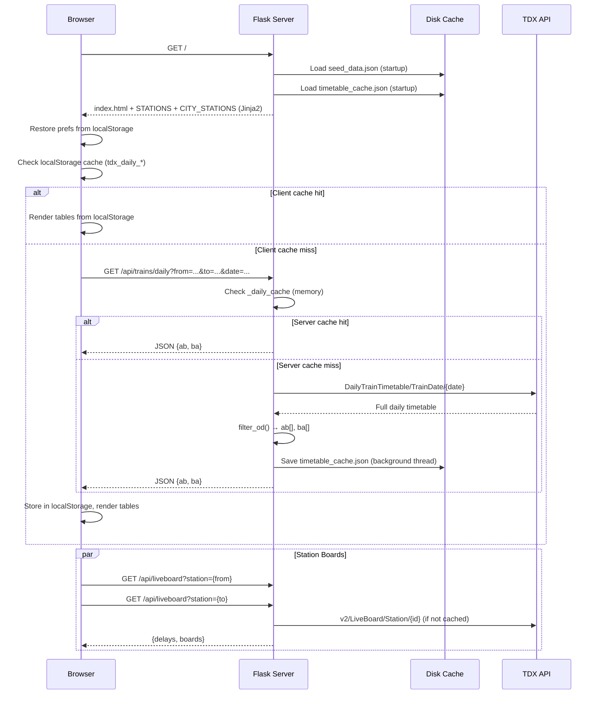
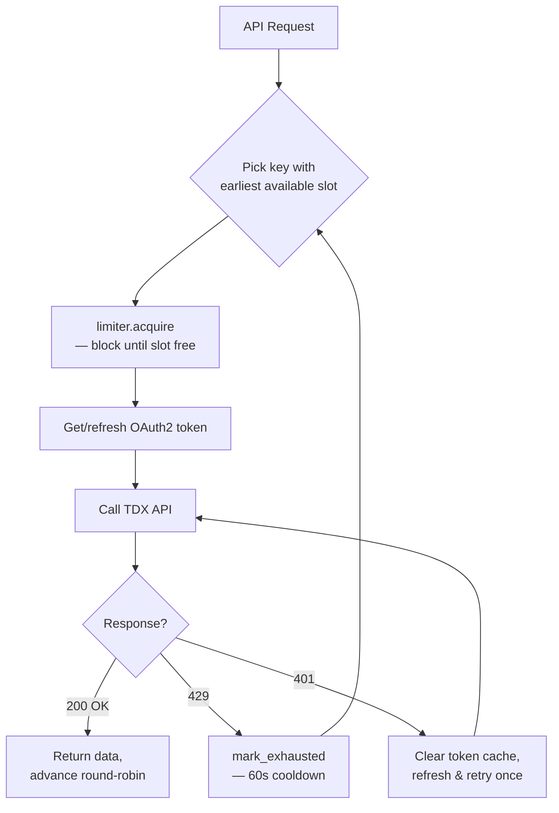
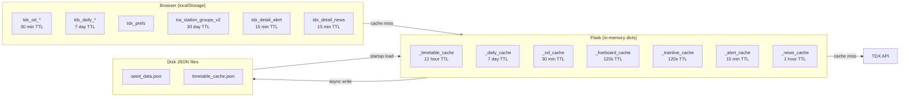

# 台鐵時刻表 — TDX Train Timetable Web App

## Briefing

A Flask-based web application that provides Taiwan Railways (TRA) timetable lookup, daily schedule queries, and real-time train status. Data is sourced from the **Taiwan Transport Data eXchange (TDX)** platform APIs. The app features a dark-themed responsive UI, multi-layer caching (client → server memory → disk), and supports deployment on Render.com.

---

## Introduction

### Features

- **常態班表查詢** — General (static) timetable OD query between any two stations
- **當日班次查詢** — Date-specific timetable with actual running trains
- **即時狀態** — Real-time delay overlay from TDX LiveBoard API
- **車站即時看板** — Live departure/arrival station boards (northbound / southbound)
- **列車詳細頁** — Individual train stop list with live position, alerts, and news
- **車種篩選** — Filter by train category: 對號列車 / 區間車 / 區間快
- **常用車站** — Frequently-used stations tracked automatically
- **城市分組選站** — City-grouped station picker with class markers (◆ ● ★ ▸)
- **顯示筆數控制** — Max visible rows: 5 / 7 / 8 / 9 / 10 / 12 / 15 / 20 / 全部
- **Mobile responsive** — Optimized layout for ≤600px / ≤768px breakpoints

### Tech Stack

| Layer      | Technology                                               |
|------------|----------------------------------------------------------|
| Backend    | Python 3.11, Flask 3.x, Gunicorn                        |
| Frontend   | Vanilla JS, Jinja2 templates, CSS3 custom properties     |
| Data       | TDX v2/v3 REST APIs (OAuth2 client_credentials)          |
| Deployment | Render.com (`render.yaml`), 1 worker / 4 threads         |
| Fonts      | Noto Sans TC, JetBrains Mono (Google Fonts)              |

### Project Structure

```
TDX_Deploy/Render/
├── app.py                    # Flask backend (~1260 lines)
├── requirements.txt          # flask, requests, gunicorn, python-dotenv
├── render.yaml               # Render.com deployment config
├── .env                      # TDX API keys (not committed)
├── .env.txt                  # Example env template
├── seed_data.json            # Bootstrap station data (auto-updated)
├── timetable_cache.json      # Disk-persisted timetable cache
├── templates/
│   ├── index.html            # Main page template
│   └── train_detail.html     # Train detail page template
└── static/
    ├── index.css             # Main page styles (~600 lines)
    ├── index.js              # Main page logic (~880 lines)
    ├── train_detail.css      # Train detail styles (~400 lines)
    └── train_detail.js       # Train detail logic (~320 lines)
```

---

## Architecture Flow

### Page Load Sequence



### API Key Rate Limiting



### Caching Architecture



---

## Environment Variables

| Variable                | Required | Description                                |
|-------------------------|----------|--------------------------------------------|
| `TDX_CLIENT_ID`        | ✅       | TDX API key #0 — Client ID                |
| `TDX_CLIENT_SECRET`    | ✅       | TDX API key #0 — Client Secret            |
| `TDX_CLIENT_ID_1`      | ❌       | TDX API key #1 — Client ID (extra pool)   |
| `TDX_CLIENT_SECRET_1`  | ❌       | TDX API key #1 — Client Secret            |
| `TDX_CLIENT_ID_2`      | ❌       | TDX API key #2 — Client ID (extra pool)   |
| `TDX_CLIENT_SECRET_2`  | ❌       | TDX API key #2 — Client Secret            |
| `FLASK_DEBUG`           | ❌       | Set to `"1"` to enable debug mode          |

Multiple API keys form a **key pool** with per-key sliding-window rate limiting (5 requests / 60 seconds). Keys are selected by earliest-available-slot with round-robin tiebreaking.

---

## API Routes

### Pages

| Route              | Method | Description                       |
|--------------------|--------|-----------------------------------|
| `/`                | GET    | Main timetable page               |
| `/train/<train_no>`| GET    | Train detail page (stops + live)  |

### JSON APIs

| Route                    | Method | Description                                         |
|--------------------------|--------|-----------------------------------------------------|
| `/api/trains`            | GET    | General timetable OD query (`from`, `to`)           |
| `/api/trains/daily`      | GET    | Daily timetable OD query (`from`, `to`, `date`)     |
| `/api/liveboard`         | GET    | Station live board + delays (`station`)              |
| `/api/station-groups`    | GET    | City→station groupings for picker                   |
| `/api/train/<no>`        | GET    | Single train metadata + full stop list               |
| `/api/trainlive/<no>`    | GET    | Real-time train position                             |
| `/api/alert`             | GET    | TRA service alerts                                   |
| `/api/news`              | GET    | TRA latest news                                      |
| `/health`                | GET    | Health check (returns `"OK"`)                        |
| `/debug/cache`           | GET    | Cache debug info (debug mode only)                   |

---

## Function Descriptions

### Backend (`app.py`)

#### Core Data Functions

| Function                         | Description                                                                                         |
|----------------------------------|-----------------------------------------------------------------------------------------------------|
| `api_get(url)`                   | Fetches a TDX API URL with per-key rate limiting, token refresh, 429 retry, and round-robin key selection |
| `get_all_trains()`               | Returns the full general (static) timetable; caches in memory + disk                                |
| `fetch_daily_trains(date_str)`   | Returns all trains for a specific date; syncs BikeFlag to general cache, prunes old dates            |
| `filter_od(all_trains, from, to)`| Filters the full timetable to trains stopping at both stations in the correct order                  |

#### Station Management

| Function                         | Description                                                                                         |
|----------------------------------|-----------------------------------------------------------------------------------------------------|
| `_load_seed_data()`              | Loads bootstrap station data from `seed_data.json` at startup                                       |
| `_load_disk_caches()`            | Restores general + daily timetable caches from `timetable_cache.json` at startup                    |
| `_load_stations_from_api()`      | Fetches all TRA stations from TDX v2, updates `STATIONS`, `_STATION_CLASSES`, `_STATION_GROUPS`     |
| `_load_branch_lines()`           | Fetches branch-line station groups from TDX StationOfLine API                                       |
| `_save_timetable_disk_cache()`   | Serializes caches to disk (atomic tmp+rename write) in a background thread                          |
| `_run_station_load_once()`       | Ensures `_load_stations_from_api()` runs exactly once per process lifetime                          |

#### Auth & Rate Limiting

| Function / Class            | Description                                                                                    |
|-----------------------------|------------------------------------------------------------------------------------------------|
| `_KeyRateLimiter`           | Per-key sliding-window rate limiter (5 req / 60s). Thread-safe with `acquire()` blocking       |
| `_load_key_pool()`          | Builds the key pool from `TDX_CLIENT_ID` / `TDX_CLIENT_SECRET` env vars (+ numbered suffixes) |
| `_get_token_for(key)`       | Returns a valid OAuth2 access token for a key entry, refreshing if expired                     |

#### Formatting Helpers

| Function                    | Description                                                      |
|-----------------------------|------------------------------------------------------------------|
| `_format_train_type(raw)`   | Shortens train type names (e.g. "自強(推拉式)" → "自強PP")        |
| `_parse_note(raw)`          | Strips "每日行駛。" prefix from train notes                       |
| `_tdx_str(v)`               | Extracts `Zh_tw` string from TDX multilingual object or plain str |

### Frontend — Main Page (`index.js`)

| Function / Object           | Description                                                                                    |
|-----------------------------|------------------------------------------------------------------------------------------------|
| `CacheManager`              | Client-side localStorage cache with TTL, 40-key limit, LRU eviction                           |
| `loadPrefs()` / `savePrefs()` | Read/write user preferences (`tdx_prefs` in localStorage)                                   |
| `trackUsage(code)`          | Increments frequency counter for a station code (for 常用車站)                                  |
| `buildCitySelect()`         | Populates city dropdown with 常用車站 group + city groups                                       |
| `buildStationSelect()`      | Populates station dropdown for a city, with class prefix markers                               |
| `queryGeneral()`            | Fetches general timetable (localStorage → server), renders both tables                         |
| `queryDaily()`              | Fetches date-specific timetable, populates `dailyBikeMap`                                      |
| `renderTable()`             | Renders a single timetable table with filtering, past-row dimming, auto-scroll to next train   |
| `renderTables()`            | Renders both AB/BA tables, measures row height for dynamic `--tbl-max-h`                       |
| `fetchStationBoards()`      | Fetches + renders live station boards for departure/arrival stations                           |
| `fetchLive()`               | Fetches live delay data and overlays delay badges on timetable rows                            |
| `overlayDelays()`           | Adds/removes delay tags (`誤X分`) on timetable row remark cells                                |
| `renderStationBoard()`      | Renders a station board card with north/south direction grouping                               |
| `_applyMaxRows(n)`          | Sets CSS variable `--tbl-max-h` using measured row heights                                     |
| `escHtml(s)`                | XSS-safe HTML escaping (`&`, `<`, `>`, `"`)                                                    |

### Frontend — Train Detail (`train_detail.js`)

| Function                    | Description                                                                                    |
|-----------------------------|------------------------------------------------------------------------------------------------|
| `loadAll()`                 | Parallel-fetches train data, live position, alerts, and news                                   |
| `renderTrain(data, live)`   | Renders the full stop table with past/current/from/to highlighting                             |
| `computeStartIdx()`         | Determines current train position from live data or time-based estimate                        |
| `renderAlerts(alerts)`      | Renders TRA service alert cards                                                                |
| `renderNews(news)`          | Renders TRA news cards (filtered to zh-tw)                                                     |
| `fetchWithTimeout(url, ms)` | Fetch wrapper with AbortController timeout (default 15s)                                       |
| `toggleSection(id)`         | Toggles collapsible alert/news sections on mobile                                              |

---

## Server-side Variables & Constants

### Cache TTLs

| Cache                  | Variable               | TTL              | Eviction Strategy                         |
|------------------------|------------------------|------------------|-------------------------------------------|
| General timetable      | `GENERAL_CACHE_TTL`    | 12 hours         | API `ExpireDate` field preferred           |
| Daily timetable        | `DAILY_CACHE_TTL`      | 7 days           | Old dates pruned (> 7 days past)           |
| OD (origin-destination)| `OD_CACHE_TTL`         | 30 minutes       | Expired entries evicted on insert          |
| LiveBoard              | `LIVEBOARD_CACHE_TTL`  | 120 seconds      | Expired entries evicted on insert          |
| TrainLive              | `TRAINLIVE_CACHE_TTL`  | 120 seconds      | Expired entries evicted on insert          |
| Alert                  | `ALERT_CACHE_TTL`      | 15 minutes       | Single entry, overwritten on refresh       |
| News                   | `NEWS_CACHE_TTL`       | 1 hour           | Single entry, overwritten on refresh       |

### Client-side Cache TTLs

| Key Pattern               | TTL         | Max Keys | Notes                              |
|---------------------------|-------------|----------|------------------------------------|
| `tdx_od_{from}_{to}`      | 30 minutes  | 40       | LRU eviction when limit exceeded   |
| `tdx_daily_{from}_{to}_{date}` | 7 days | 40       | Shared limit with OD cache         |
| `tra_station_groups_v2`   | 30 days     | 1        | Station city groups                |
| `tdx_detail_alert`        | 15 minutes  | 1        | Train detail page alerts           |
| `tdx_detail_news`         | 15 minutes  | 1        | Train detail page news             |
| `tdx_prefs`               | ∞           | 1        | User preferences (from, to, maxRows, freq) |
| `tdx_stn_mode`            | ∞           | 1        | Station board display mode (0–3)   |
| `tdx_cache_ver`           | ∞           | 1        | Cache version for invalidation     |

### Rate Limiter

| Constant                   | Value             | Description                        |
|----------------------------|-------------------|------------------------------------|
| `_KeyRateLimiter.WINDOW`   | 60 seconds        | Sliding window size                |
| `_KeyRateLimiter.MAX_REQ`  | 5                 | Max requests per key per window    |

### Station Data Constants

| Variable               | Description                                                       |
|------------------------|-------------------------------------------------------------------|
| `STATIONS`             | `dict[str, str]` — station name → code (e.g. `"台北": "0970"`)   |
| `_STATION_CLASSES`     | `dict[str, int]` — code → class (0=特等, 1=一等, 2=二等, 3=三等, 4=簡易) |
| `_STATION_GROUPS`      | `list[dict]` — city groups `[{city, codes}, ...]` in geographic order |
| `_STATION_PHONES`      | `dict[str, str]` — code → phone number                           |
| `_STATION_ADDRESSES`   | `dict[str, str]` — code → address                                |
| `_HIDDEN_STATION_IDS`  | `set` — virtual/special stations hidden from UI (`1001`, `5170`, `5998`, `5999`) |
| `_CITY_ORDER`          | `list[str]` — 19 cities in north-to-south display order          |
| `_TRIP_LINE_MAP`       | `{1: "山線", 2: "海線", 3: "成追線"}`                             |
| `_BRANCH_LINE_GROUPS`  | Hardcoded fallback for 7 branch lines (內灣/六家/集集/成追/沙崙/平溪/深澳) |
| `_VALID_CODES`         | `set[str]` — all valid station codes for input validation         |

---

## CSS Design System

### Theme Variables (`:root`)

| Variable       | Value       | Usage                         |
|----------------|-------------|-------------------------------|
| `--bg`         | `#05111f`   | Page background               |
| `--surface`    | `#0a1e33`   | Header, controls, status bar  |
| `--panel`      | `#0d2540`   | Cards, inputs, buttons        |
| `--border`     | `#163556`   | Borders, separators           |
| `--blue`       | `#4da8e8`   | Primary accent                |
| `--blue-dim`   | `#2a6a9e`   | Secondary blue                |
| `--gold`       | `#f5c842`   | Train numbers, headers        |
| `--green`      | `#56d98a`   | Express badges, on-time       |
| `--red`        | `#f87171`   | Errors, delays                |
| `--orange`     | `#fb923c`   | Return trip, arrival station  |
| `--fg`         | `#c8dff0`   | Primary text                  |
| `--fg-dim`     | `#6a8faa`   | Secondary / dimmed text       |
| `--font-mono`  | `JetBrains Mono` | Train numbers, times      |
| `--font-main`  | `Noto Sans TC`   | Body text                 |
| `--radius`     | `8px`       | Border radius                 |
| `--transition` | `0.18s ease`| Default transition            |

### Dynamic Table Height

```css
.table-scroll {
  max-height: var(--tbl-max-h, calc(40px * 8 + 37px));
  overflow-y: auto;
}
```

`--tbl-max-h` is set dynamically by JavaScript after measuring actual rendered row heights (`_measuredRowH`, `_measuredTheadH`), ensuring correct row counts on both desktop and mobile.

### Responsive Breakpoints

| Breakpoint    | Target            | Key Changes                                                    |
|---------------|-------------------|----------------------------------------------------------------|
| `≤ 800px`     | Layout            | Tables stack vertically (single column)                        |
| `≤ 768px`     | Tablet / Mobile   | Compact controls, smaller fonts, hide header subtitle          |
| `≤ 600px`     | Mobile            | Station boards stack, mobile bar shown, further size reduction |

### Train Type Color Coding

| Category      | Badge Class       | Background                | Text Color    |
|---------------|-------------------|---------------------------|---------------|
| 對號列車      | `.badge-reserved` | `rgba(245,200,66,.15)`    | Gold          |
| 區間快        | `.badge-express`  | `rgba(86,217,138,.15)`    | Green         |
| 區間車        | `.badge-local`    | `rgba(77,168,232,.15)`    | Blue          |

### Remark Tag Styles

| Tag Type       | Class              | Color   | Example          |
|----------------|--------------------|---------|------------------|
| Route line     | `.remark-line`     | Blue    | 山線, 海線       |
| Schedule note  | `.remark-schedule` | Gold    | 週六行駛         |
| Seat info      | `.remark-seat`     | Red     | 無座             |
| Bike allowed   | `.remark-bike`     | Green   | 🚲               |
| Delay          | `.remark-delay`    | Red     | 誤5分             |

---

## Security

| Measure                        | Implementation                                                     |
|--------------------------------|--------------------------------------------------------------------|
| Content Security Policy        | `@app.after_request` — `default-src 'self'`, `frame-ancestors 'none'` |
| X-Content-Type-Options         | `nosniff`                                                          |
| X-Frame-Options                | `DENY`                                                             |
| XSS Prevention                 | `escHtml()` in both JS files; `encodeURIComponent()` for URL params |
| Input Validation               | Station codes checked against `_VALID_CODES`; train numbers: `^\d{1,5}$`; dates: strict `YYYY-MM-DD` + range check |
| Debug endpoint gated           | `/debug/cache` returns 404 unless `FLASK_DEBUG=1`                  |
| Atomic disk writes             | tmp file + `Path.replace()` for both seed and timetable cache      |
| Thread safety                  | `_cache_lock`, `_pool_lock`, `_station_load_lock`, `_save_lock`    |

---

## Thread Locks

| Lock                  | Protects                                                          |
|-----------------------|-------------------------------------------------------------------|
| `_cache_lock`         | All 7 in-memory cache dicts + token caches + station globals      |
| `_pool_lock`          | `_pool_index` (round-robin key selection)                         |
| `_station_load_lock`  | `_station_load_done` flag (ensures one-time station API load)     |
| `_save_lock`          | Disk write serialization (non-blocking `acquire`)                 |

---

## Quick Start

```bash
# 1. Clone and enter project
cd TDX_Deploy/Render

# 2. Create virtual environment
python -m venv .venv
.venv\Scripts\activate  # Windows
# source .venv/bin/activate  # Linux/Mac

# 3. Install dependencies
pip install -r requirements.txt

# 4. Set up environment variables
cp .env.txt .env
# Edit .env with your TDX API credentials

# 5. Run development server
python app.py
# → http://localhost:5000
```

### Production (Render.com)

Configured via `render.yaml`:
```
gunicorn app:app --workers 1 --threads 4 --timeout 120
```

---

## TDX API Endpoints Used

| Endpoint                                           | Version | Purpose                  |
|----------------------------------------------------|---------|--------------------------|
| `GeneralTrainTimetable`                            | v3      | Static timetable         |
| `DailyTrainTimetable/TrainDate/{Date}`             | v3      | Date-specific timetable  |
| `Station`                                          | v2      | Station data + classes   |
| `StationOfLine`                                    | v3      | Branch line grouping     |
| `LiveBoard/Station/{ID}`                           | v2      | Station live board       |
| `TrainLiveBoard/TrainNo/{No}`                      | v3      | Train live position      |
| `Alert`                                            | v3      | Service alerts           |
| `News`                                             | v3      | Latest news              |

---

*TDX Sample v1.0 — Copyright © 2026 KevinRewolf*
*資料介接「交通部TDX平臺」& 平臺標章*
